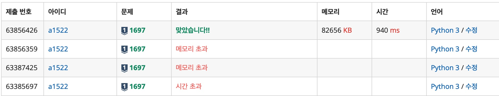

# 2023-07-21 Week 3 배운 점 정리

## 1697 숨바꼭질

+ BFS를 이용한 풀이
    + BFS를 이용하여 풀이하였음.
    + `cur` 이라는 변수에 현재 위치를 저장하고, `cnt` 라는 변수에 현재 위치까지 오는데 걸린 시간을 저장함.
    + `cur` 이라는 변수가 `end` 변수와 같아지면 `cnt` 를 반환함.

저번 주차에 코드를 위와 같은 논리를 가지고 코드를 작성하였지만 시간초과, 메모리 초과로 인한 채점이 불가능했다.

아래는 시간초과, 메모리 초과가 발생한 채점 기록 사진이다.



메모리 초과가 발생했던 이유는 BFS를 이용하여 풀이할 때 `append` 를 할 때마다 `queue` 에 중복된 데이터가 쌓이는 경우를 배제하지 않았기 때문이다.

큐에 중복된 데이터를 쌓지 않지 위해서 `sett` 라는 변수를 만들어서 `cur` 변수가 `sett` 에 포함되어 있지 않을 경우에만 `queue` 에 `append` 를 하도록 하였다.
`visited` 라고 코드를 작성했으면 가독성이 더 좋았을 것 같다.

``` python
from collections import deque

cur, end = map(int, input().split())

def bfs(cur, end):
    sett = set()
    queue = deque()
    queue.append([cur, 0])

    while queue:
        cur, cnt = queue.popleft()
        sett.add(cur)
        if cur == end:
            return cnt
        else:
            if cur * 2 <= 100000 and cur * 2 not in sett:
                queue.append([cur * 2, cnt + 1])
            if cur + 1 <= 100000 and cur + 1 not in sett:
                queue.append([cur + 1, cnt + 1])
            if cur - 1 >= 0 and cur - 1 not in sett:
                queue.append([cur - 1, cnt + 1])

        # 못 찾았을 경우
    return -1

print(bfs(cur, end))
```

## 2606 바이러스

+ DFS를 이용한 풀이
    + DFS를 이용하여 풀이하였음.
    + `graph` 라는 변수에 컴퓨터의 연결 정보를 저장하고, `visited` 라는 변수에 방문 여부를 저장함.
    + `dfs` 라는 함수를 만들어서 `graph` 와 `visited` 를 인자로 받고, `dfs` 함수 안에서 `visited` 를 `True` 로 바꾸고, `graph` 를 순회하면서 `visited` 가 `False` 이고, `graph` 의 시작점과 끝점이 같은 경우에 `dfs` 함수를 재귀적으로 호출함.
    + `dfs` 함수가 호출될 때마다 global로 함수내에서 선언하여 `cnt` 를 1씩 증가시킴.


```python
com, pair = int(input()), int(input())
graph = [list(map(int, input().split())) for _ in range(pair)]
visited = [False] * (com + 1)
cnt = 0


def dfs(graph, v, visited):
    global cnt
    visited[v] = True
    for s, e in graph:
        if s == v and not visited[e]:
            cnt += 1
            dfs(graph, e, visited)
        elif e == v and not visited[s]:
            cnt += 1
            dfs(graph, s, visited)

dfs(graph, 1, visited)

print(cnt)
```

## 1764 듣보잡

+ Set 자료형의 합집합 연산을 이용한 풀이
    + `set` 자료형의 합집합 연산을 이용하여 `set` 자료형에 듣도 못한 사람과 보도 못한 사람을 저장함.
    + `list` 자료형의 `sorted` 함수를 이용하여 사전 순으로 정렬함.
    + `len` 함수를 이용하여 듣도 보도 못한 사람의 수를 출력함.
    + `for` 문을 이용하여 듣도 보도 못한 사람을 출력함.

```python
N,M = map(int, input().split())

D = [input() for _ in range(N)]
B = [input() for _ in range(M)]
DB = list(set(D) & set(B))

print(len(DB))
for i in sorted(DB):
    print(i)
```
