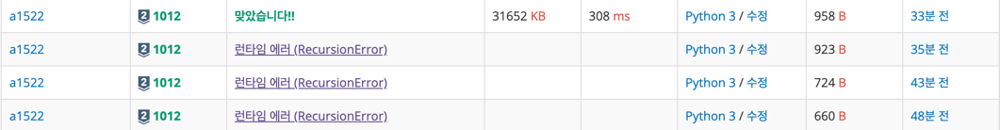

# 2023-07-03 Week 1 배운 점 정리

## 1012 유기농 배추

+ Python3 최대 재귀한도 깊이 설정 문제 ( Maximum recursion depth exceed )
<p> 작성한 코드의 로직은 맞다고 판단 하였으나 뜬금없는 런타임 에러의 난관에 도달함.</p>



<p> RecursionError : maximum recursion depth exceeded while calling a Python object </p>
<p> 즉, 파이썬에서 재귀함수를 사용할 때 최대 깊이가 1000으로 기본 설정 되어 있는데 그것을 넘기는 코드를 작성하게 되어서 발생하는 오류,
그 제한을 가제로 바꾸어주는 역할을 하는 코드를 윗 단에 추가하여 해결함.</p>

```python
import sys

sys.setrecursionlimit(10000)
```

위 코드를 삽입하여 해결하였음.

<p>나머지 솔루션은 DFS를 이용하여 풀이하였음.
배추가 심어져 있는지 아닌지는 arr 리스트에 1과 0을 문제 입력에 따라 받았고, 그리고 DFS를 위한 방문 여부 확인은 visited 리스트를 이용하였음.</p>


## 1074 Z

+ 분할 정복 문제
    + 문제를 풀기 위해선 분할 정복을 이용하여야 했음. 
    + 분할 정복이란 큰 문제를 작은 문제로 나누어 푸는 것을 의미함. 
    + 이 문제의 경우 2차원 배열을 4등분 하여 각각의 배열에 대해 재귀적으로 탐색을 진행하여야 함.
    + 이때, 재귀적으로 탐색을 진행할 때마다 4등분을 하여야 하므로 2의 제곱수인 4를 계속해서 곱해주어야 함.

아직 코드를 작성하지 못해 풀지 못했으나 오늘 공부한 이론을 바탕으로 다시 풀어보기로 함.

