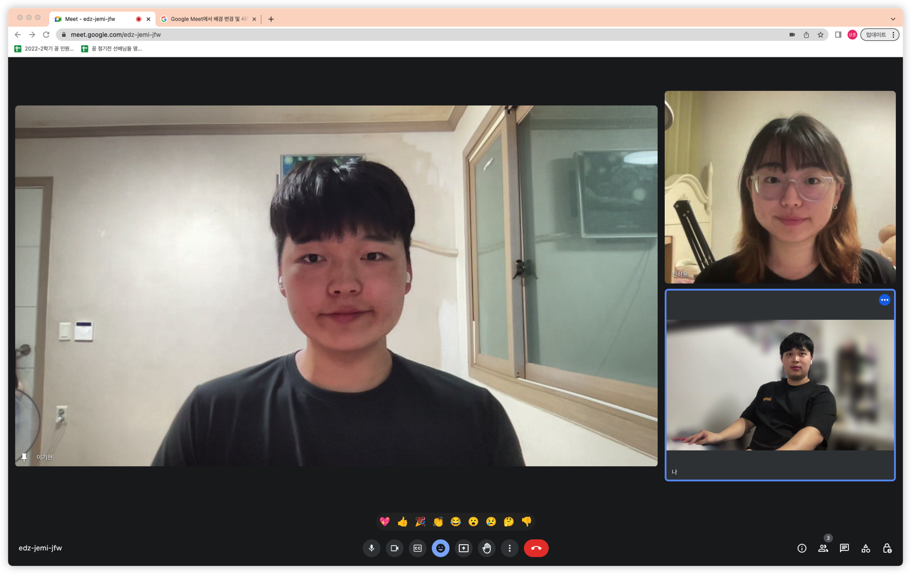
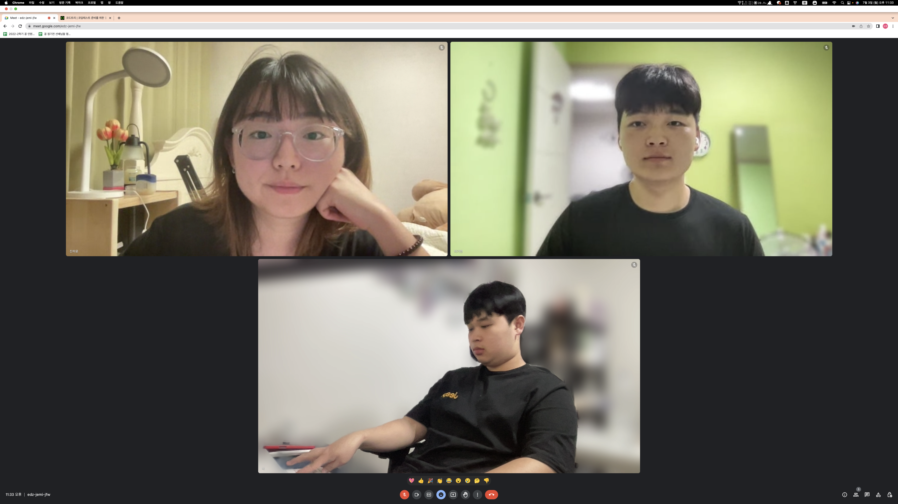

# Week 1 공부 기록

## 활동 사진

### 시작 시간 : 20:30 / 종료 시간 : 23 : 30

## 소감

+ 이기현

활동 내용 : 백준 온라인 저지에서 [solved.ac Class3] 문제 중 DFS 관련 문제 풀며 풀이법을 작성하고, 문제 해결에 대한 과정을 정리 함. 분할 정복에 대한 이론을 공부함.

소감 : 파이썬에 익숙하지 않아 해결하는 데 시간이 많이 소요되었음. 기본적인 문제풀이에 필요한 파이썬 라이브러리를 숙지하는 것이 필요하다는 것을 느낌

+ 이상훈

활동 내용 : 백준 온라인 저지와 코드트리 강의를 참고하여 동적 계획법 문제를 공부하고 풀이를 정리하였음. Memoization 기법과 tabulation 기법에 대해서 배움.

소감 : 원래 알고 있던 내용이라 금방 넘어갈 줄 알았으나 강의를 듣다가 보니 동적계획법의 시간복잡도나 다양한 유형들이 있다는 사실을 알게 되었음. 다음 주에는 더욱 더 다양한 유형에 도전해 볼 생각임.

+ 진하윤

활동 내용 : 운영체제 강의노트 1, 2 학습 및 PA_0 push_stack()함수 구현

소감 : 주어진 스켈레톤 코드 해석에 시간이 많이 소요되었다. 다음시간에는 해당과제를 완료해야겠다.
