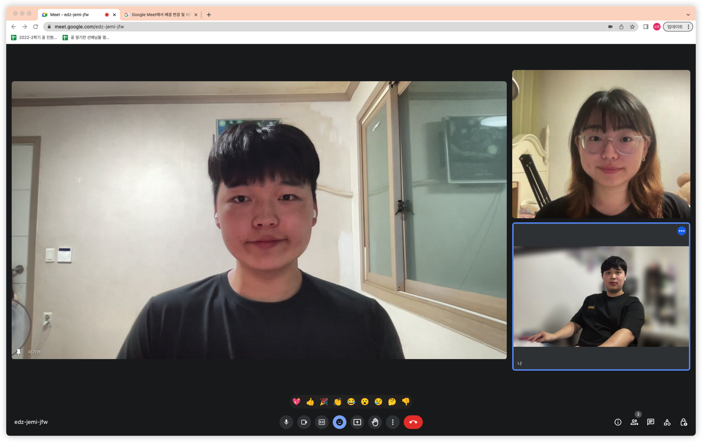

# Week 2 공부 기록

## 활동 사진

### 시작 시간 : 20:30 / 종료 시간 : 23 : 30

## 소감

+ 이기현

활동 내용 : 백준 온라인 저지에서 [solved.ac Class3] 문제 중 BFS, DP(분할 정복) 관련 문제 풀며 풀이법을 작성하고, 문제 해결에 대한 과정을 정리 함. 또한 파이썬의 Hash Table격인 Dictionary에 대해 공부하고 이를 정리함. 

소감 : 꾸준히 하지 않으면 자꾸 까먹고 잊게 되기 때문에 더 열심히 해야겠다는 생각이 듦. 또한 시간초과와 메모리 초과에 대해 다시 한 번 생각해보게 되었고, 어떤 이유에서 문제가 발생하는 것 인지 다시 한번 확인하는 계기가 되는 주차였음.

+ 이상훈

활동 내용 : 백준 온라인 저지와 코드트리 강의를 참고하여 격자에서의 동적 계획법 문제를 풀었음

소감 : 동적 계획법과 dfs와 같이 주변 격자들을 탐색하는 문제가 있었는데 동적 계획법에서 제일 중요한 것은 점화식과 순서의 흐름이라는 것을 배울 수 있었음. 다음에 이런 유형이 나와도 잘 대처할 수 있을 것 같다는 자신감이 생김

+ 진하윤

활동 내용 : PA_0 과제 완료
- pop_stack() 함수 구현
- dump_stack() 함수 구현
- push_stack() 함수 수정

소감 : pa1의 과제 내용은 운영체제에 대한 학습을 해야 스켈레톤코드를 이해하고 문제해결을 할 수 있을 것 같아 다음시간에는 해당 부분에 대한 이론 공부를 수행해야겠다.
