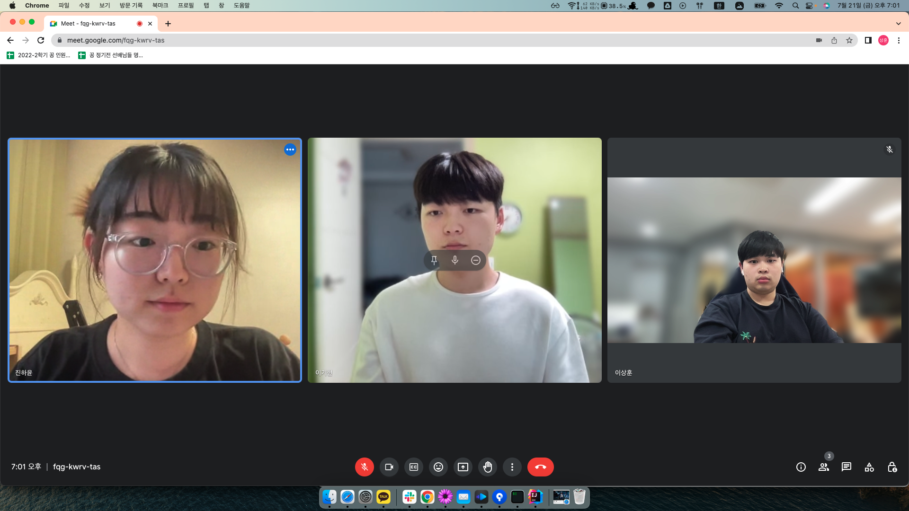

# Week 2 공부 기록

## 활동 사진

### 시작 시간 : 19:00 / 종료 시간 : 22:00

## 소감

+ 이기현

활동 내용 : 백준 온라인 저지에서 [solved.ac Class3] 문제 중 BFS, DFS 관련 문제 풀며 풀이법을 작성하고, 문제 해결에 대한 과정을 정리 함. 

소감 : 간단한 DFS 문제와 BFS 문제는 풀 수 있게 된 것 같아 다음주에는 좀 어려운 문제를 풀어봐도 좋겠다.

+ 이상훈

활동 내용 : 백준 온라인 저지와 코드트리 강의를 참고하여 애드혹과 이분탐색 문제를 풀어보았음.

소감 : 애드혹은 유형이 없는 줄 알고 그냥 머리를 열심히 써야하는 문제 유형인 줄 알았으나 유형화가 가능하다는 점을 깨달았음. 이를 바탕으로 더욱 더 어려운 애드혹에 도전해볼 예정임. 또한 이분탐색을 활용해서 문제의 정답을 알아가는 과정이 신기하다고 생각하였음.

+ 진하윤

활동 내용 : shell 개념 학습

소감 : 다음주에는 이번주 배운 내용을 이용하여 pa1의 스켈레톤 코드를 분석하고 과제를 수행
