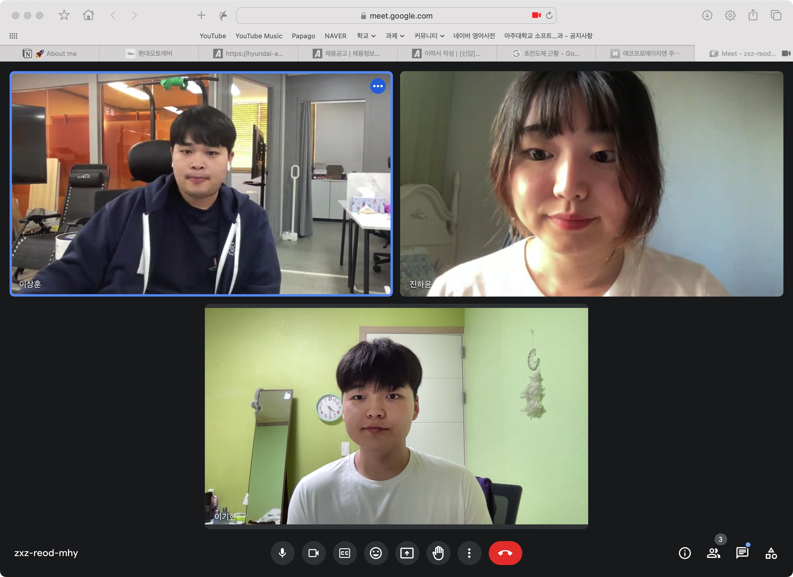

# Week 4 공부 기록

## 활동 사진

### 시작 시간 : 18:30 / 종료 시간 : 21:30

## 소감

+ 이기현

활동 내용 : 백준 온라인 저지에서 이분탐색 관련 문제 풀며 풀이법을 작성하고, 문제 해결에 대한 과정을 정리 함, 또한 파이썬 이분탐색 라이브러리인 `bisect`에 대해서 정리함. 

소감 : 이분 탐색 알고리즘 말고 다른 탐색 알고리즘에 대해서 공부할 필요가 있어, 다음 주차에는 다른 정렬, 탐색 문제를 풀이할 예정임. 

+ 이상훈

활동 내용 : 코드트리의 진단 테스트 응시를 진행하였으며 Parametric Search 에 대해서 학습하였음.

소감 : 생각보다 부족한 점이 많다는 것을 테스트를 통해 알 수 있었으며 Parametric Search 문제의 유형을 더욱 더 많이 학습해야겠다는 것을 배울 수 있었음. 또한 구현력이 생각보다 뛰어나지 않은 것 같아 구현 문제를 다음 주에는 학습해 볼 생각임.

+ 진하윤

활동 내용 : 

소감 : 
