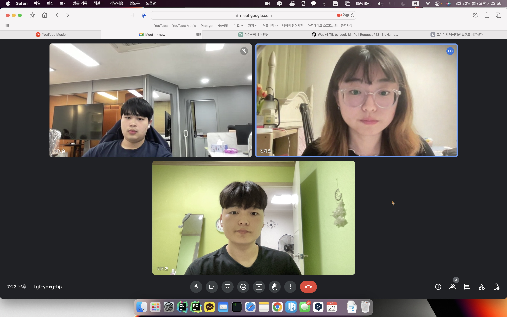

# Week 5 공부 기록

## 활동 사진

### 시작 시간 : 19:30 / 종료 시간 : 22:30

## 소감

+ 이기현

활동 내용 : 

소감 : 

+ 이상훈

활동 내용 : 코드트리의 삼성 기출 문제를 2문제 풀이 하였음.

소감 : 구현 문제로 유명한 삼성 기출 문제를 풀어보면서 디버깅을 하는 연습을 많이 하게 되었음. 복잡한 알고리즘을 사용하지는 않지만 꼼꼼하게 구현을 해나가면서 함수들을 잘 나누는 것의 중요성을 깨닫게 되었음.

+ 진하윤

활동 내용 :

소감 :
